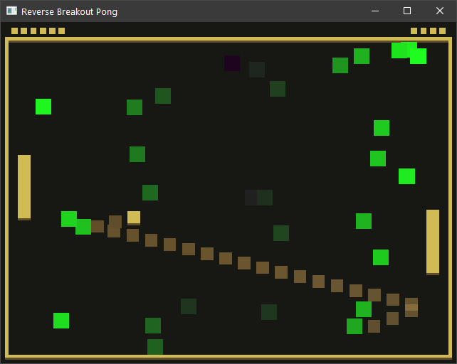

# (Reverse Breakout Pong)

Author: (Pavan Paravasthu)

Design: ( And insanely fast and chaotic variation of pong where, every time the ball touches a player's paddle, an obstacle is spawned in the opposite player's half court randomly. The initial conception was to provide a rubberband mechanic. But it turned out to be a weird "watch it unfold" thing. )

Screen Shot:

How To Play:

(Control the paddle on the left with the mouse. There is no end goal as such. It's just fun to watch the ball keep losing its mind and bouncing around the screen)

This game was built with [NEST](NEST.md).
